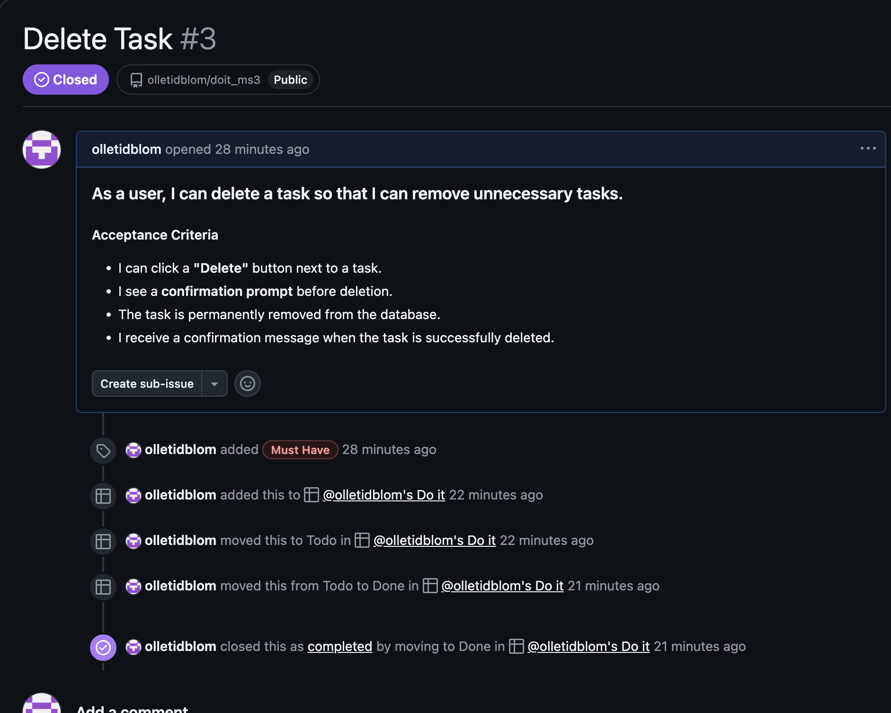

# DoIt - Django To-Do App


**Developer: Olle
💻 [Visit Live Website](https://doitms3-10b442815bf1.herokuapp.com/)  
(Ctrl + click to open in new tab)

---

## 📖 Table of Contents
- [About](#about)
- [User Goals](#user-goals)
- [Site Owner Goals](#site-owner-goals)
- [User Experience](#user-experience)
- [User Stories](#user-stories)
- [Design](#design)
  - [Colours](#colours)
  - [Fonts](#fonts)
  - [Structure](#structure)
  - [Wireframes](#wireframes)
- [Technologies Used](#technologies-used)
- [Features](#features)
- [Validation](#validation)
- [Testing](#testing)
- [Bugs](#bugs)
- [Heroku Deployment](#heroku-deployment)
- [Credits](#credits)
- [Acknowledgements](#acknowledgements)

---

## 📝 About

DoIt is a simple and intuitive to-do list application built with Django. Users can create, edit, and delete tasks, making it easier to stay organized.

---

## 🎯 User Goals
- Create and manage tasks efficiently.
- Mark tasks as completed.
- Edit or delete tasks when needed.
- Responsive design for accessibility on any device.

## 🎯 Site Owner Goals
- Provide a simple and user-friendly task management system.
- Ensure security through authentication.
- Deploy a reliable and scalable web application.

---

## 🎨 User Experience

### 🎯 Target Audience
- Individuals looking for a simple task management solution.
- Professionals managing daily work tasks.
- Students organizing their assignments.

### 🎯 User Requirements & Expectations
- Simple and intuitive navigation.
- Fast task creation and management.
- Secure authentication.
- Mobile-friendly and responsive UI.

---

## ✅ User Stories

### Users
### Users
<details><summary>1. As a user, I can create a task so that I can track my to-dos.</summary>

</details>

<details><summary>2. As a user, I can edit a task so that I can update its details.</summary>

</details>

<details><summary>3. As a user, I can delete a task so that I can remove unnecessary tasks.</summary>

</details>

<details><summary>4. As a user, I can mark a task as completed so that I can keep track of finished work.</summary>

</details>

<details><summary>5. As a user, I can register and log in so that my tasks are saved.</summary>

</details>

<details><summary>6. As a user, I can create and assign a category to a task.</summary>

</details>

<details><summary>7. As a user, I can paginate through my task list so that I can navigate large lists easily.</summary>

</details>

<details><summary>8. As a user, I can receive confirmation messages when I create, edit, or delete a task so that I know my actions were successful.</summary>

</details>

<details><summary>9. As a user, I can log out so that my account remains secure.</summary>

</details>

### Admin

<details><summary>10. As an admin, I can view all user tasks so that I can manage user activity.</summary>

</details>

<details><summary>11. As an admin, I can delete inappropriate or spam tasks so that the platform remains clean.</summary>

</details>

<details><summary>12. As an admin, I can create and manage categories so that users have a structured way to organize tasks.</summary>

</details>

<details><summary>13. As an admin, I can enable or disable user accounts so that I can control platform access.</summary>

</details>

<details><summary>14. As an admin, I can edit user tasks in case of data corrections or issues.</summary>

</details>

<details><summary>15. As an admin, I can access an admin dashboard so that I can manage tasks and users efficiently.</summary>

</details>

---

## 🎨 Design

### 🎨 Colours
A modern minimalistic colour scheme was used to keep the UI clean and easy to read.

### 🎨 Fonts
Georiga was used to ensure a professional and legible typeface.

### 🎨 Structure
The site follows a **dashboard-style layout**, with an intuitive **task management interface**.

### 🎨 Wireframes
Wireframes were created using [Balsamiq](https://balsamiq.com/) to plan the UI structure.

<details><summary>Log In</summary>

</details>
<details><summary>Sign Up</summary>

</details>
<details><summary>Task List</summary>

</details>
<details><summary>Task View</summary>

</details>
<details><summary>User Info</summary>

</details>

---

## 🛠️ Technologies Used

### 📌 Languages & Frameworks
- **Python** (Django Framework)
- **HTML, CSS** (Bootstrap 5 for styling)
- **JavaScript** (for interactive UI elements)
- **PostgreSQL** (Database)

### 📌 Libraries & Tools
- **Django-Allauth** (User authentication)
- **WhiteNoise** (Static file handling on Heroku)
- **Crispy Forms** (Bootstrap styling for forms)
- **djrichtextfield** (Rich text formatting)
- **Heroku** (Deployment)
- **GitHub** (Version control)

---

## Features
The page consists of 2 pages and fourteen features

### Start Screen
- Consists of the logo
- Allows users to easily start a game or learn how to play.
- Features the footer with info and contact form.
- User story 3, 6
<details><summary>Start Screen</summary>

</details>

### Footer
- Shows info about the creator. 
- Contains a contact form where people can send in suggestions and feedback.
- User story 6
<details><summary>Footer</summary>

</details>


### Contact Form
- Allows the user get in touch with the company

- User story 6, 
<details><summary>Contact Form</summary>

</details>

 
### Player Amount
- Lets the user choose how many players should be in the game
- User story 1
<details><summary>Player Amount</summary>

</details>


### Player info
- Allows the user assign names and colors to players.
- Allows the user to choose if player should be bot or not.
- User story 2
<details><summary>Player Info</summary>

</details>


### Main Game
- Allows the user to play the game.
- Shows total score and round score. 
- Shows players turn. 
- Buttons to select cards and castles
- Shows winner when game is over
- User Stories 4, 5 , 7 
<details><summary>Main Game</summary>

</details>


### Card Board
- Allows user to choose between randomly placed cards.

<details><summary>Card Board</summary>

</details>


### Castle Board
- Allows user to choose a castle to place. 
- Shows user how many castle of each type they have left
<details><summary>Castle Board</summary>

</details>


### 404page
- If something foes wrong its an easy way back to the mainpage.
- User story 8
<details><summary>404</summary>

</details>

## 🔥 Features

### ✅ User Authentication
- Users can **register**, **log in**, and **log out**.
- Secure authentication handled by Django-Allauth.

### ✅ Task Management
- Create, update, and delete tasks.
- Mark tasks as complete.
- Filter tasks by status (Pending/Completed).

### ✅ Responsive Design
- Works seamlessly on desktops, tablets, and mobile devices.

### ✅ Secure Data Storage
- User data is stored securely in a PostgreSQL database.

---

## ✔️ Validation
- HTML and CSS validated using **W3C Validator**.
- Python code checked with **PEP8 compliance**.
- JavaScript validated using **JSHint**.
- Accessibility tested using **Lighthouse** and **WAVE**.

---

## 🧪 Testing

### ✅ Manual Testing
- Tested on multiple browsers (Chrome, Firefox, Safari).
- Mobile responsiveness verified on real devices and emulators.


---

## 🐞 Bugs

### Fixed Issues
- **CSS not loading on Heroku** → Fixed by setting `STATIC_ROOT` and using WhiteNoise.
- **Missing environment variables** → Resolved by setting `SECRET_KEY` and `DATABASE_URL` in Heroku.

### Known Issues
- Some minor UI inconsistencies on smaller screens.

---

## 🚀 Heroku Deployment

### 1️⃣ **Create Heroku App**
```sh
heroku create doit-todo-app
```

### 2️⃣ **Set Up Environment Variables**
```sh
heroku config:set SECRET_KEY='your-secret-key'
heroku config:set DATABASE_URL='your-database-url'
```

### 3️⃣ **Push to Heroku**
```sh
git push heroku main
```

### 4️⃣ **Run Migrations**
```sh
heroku run python manage.py migrate
```

### 5️⃣ **Restart Heroku App**
```sh
heroku restart
```

---

## 📜 Credits

### 📷 Images
- Placeholder images sourced from **ChatGpt**, edited with GIMP.

### 📌 Code
- Bootstrap templates used for styling.
- Django documentation used for authentication and static file handling.

---

## 💙 Acknowledgements
- Special thanks to **Mo Shami** for guidance.
- Inspired by **Django tutorials and online resources**.
- Thanks to **Code Institute** for support.

##### Back to [top](#table-of-contents)

