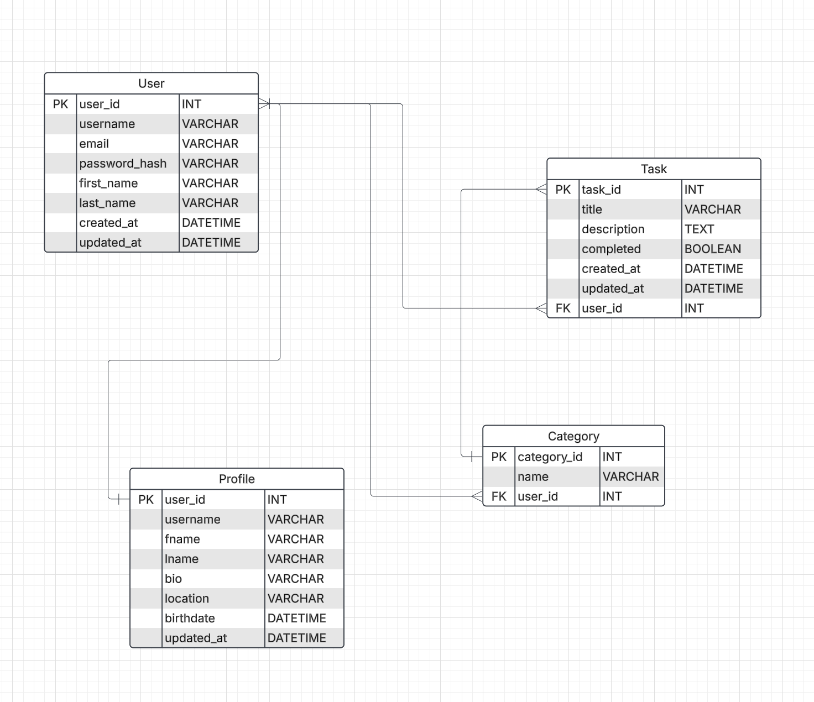
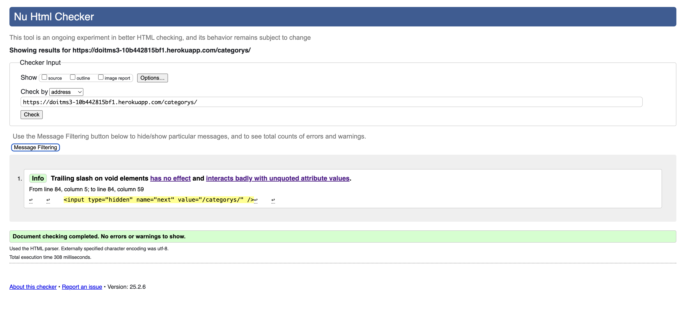
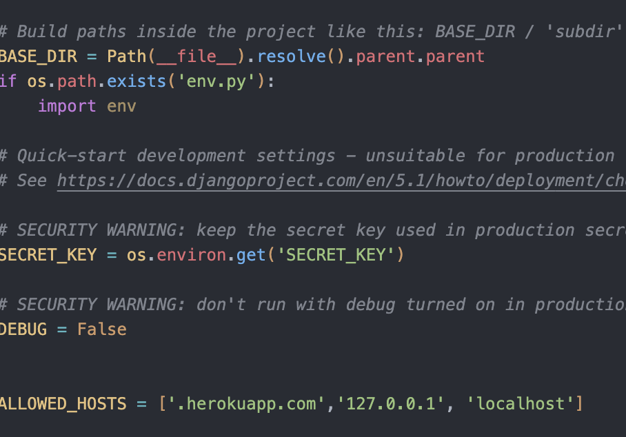
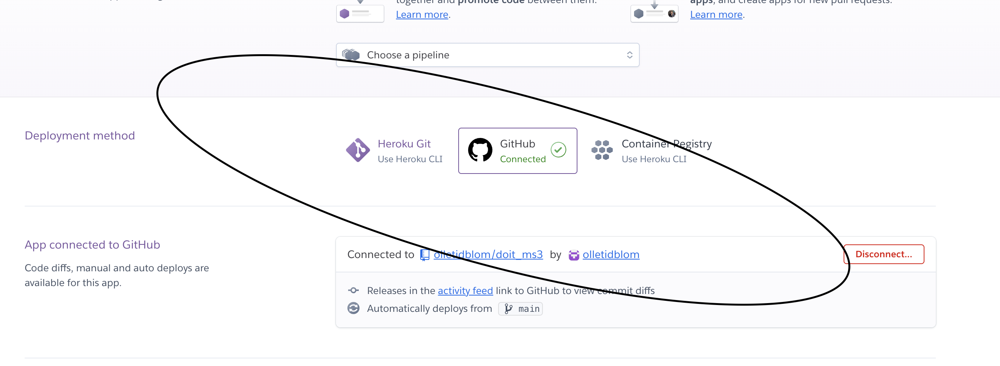

# DoIt - Django To-Do App


**Developer: Olle
💻 [Visit Live Website](https://doitms3-10b442815bf1.herokuapp.com/)  
(Ctrl + click to open in new tab)

---

## 📖 Table of Contents
- [About](#about)
- [User Goals](#user-goals)
- [Site Owner Goals](#site-owner-goals)
- [User Experience](#user-experience)
- [User Stories](#user-stories)
- [Design](#design)
  - [Colours](#colours)
  - [Fonts](#fonts)
  - [Structure](#structure)
  - [Wireframes](#wireframes)
- [Technologies Used](#technologies-used)
- [Features](#features)
- [Validation](#validation)
- [Testing](#testing)
- [Bugs](#bugs)
- [Heroku Deployment](#heroku-deployment)
- [Credits](#credits)
- [Acknowledgements](#acknowledgements)

---

## 📝 About

DoIt is a simple and intuitive to-do list application built with Django. Users can create, edit, and delete tasks, making it easier to stay organized.

---

## 🎯 User Goals
- Create and manage tasks efficiently.
- Mark tasks as completed.
- Edit or delete tasks when needed.
- Responsive design for accessibility on any device.

## 🎯 Site Owner Goals
- Provide a simple and user-friendly task management system.
- Ensure security through authentication.
- Deploy a reliable and scalable web application.

---

## 🎨 User Experience

### 🎯 Target Audience
- Individuals looking for a simple task management solution.
- Professionals managing daily work tasks.
- Students organizing their assignments.

### 🎯 User Requirements & Expectations
- Simple and intuitive navigation.
- Fast task creation and management.
- Secure authentication.
- Mobile-friendly and responsive UI.

---

## ✅ User Stories

### Users
<details><summary>1. As a user, I can create a task so that I can track my to-dos.</summary>

</details>

<details><summary>2. As a user, I can edit a task so that I can update its details.</summary>

</details>

<details><summary>3. As a user, I can delete a task so that I can remove unnecessary tasks.</summary>

</details>

<details><summary>4. As a user, I can mark a task as completed so that I can keep track of finished work.</summary>

</details>

<details><summary>5. As a user, I can register and log in so that my tasks are saved.</summary>

</details>

<details><summary>6. As a user, I can create and assign a category to a task.</summary>

</details>

<details><summary>7. As a user, I can paginate through my task list so that I can navigate large lists easily.</summary>

</details>

<details><summary>8. As a user, I can receive confirmation messages when I create, edit, or delete a task so that I know my actions were successful.</summary>

</details>

<details><summary>9. As a user, I can log out so that my account remains secure.</summary>

</details>

### Admin

<details><summary>10. As an admin, I can view all user tasks so that I can manage user activity.</summary>

</details>

<details><summary>11. As an admin, I can delete inappropriate or spam tasks so that the platform remains clean.</summary>

</details>

<details><summary>12. As an admin, I can create and manage categories so that users have a structured way to organize tasks.</summary>

</details>

<details><summary>13. As an admin, I can enable or disable user accounts so that I can control platform access.</summary>

</details>

<details><summary>14. As an admin, I can edit user tasks in case of data corrections or issues.</summary>

</details>

<details><summary>15. As an admin, I can access an admin dashboard so that I can manage tasks and users efficiently.</summary>

</details>

---

## 🎨 Design

### 🎨 Colours
A modern minimalistic colour scheme was used to keep the UI clean and easy to read.

### 🎨 Fonts
Georiga was used to ensure a professional and legible typeface.

### 🎨 Structure
The site follows a **dashboard-style layout**, with an intuitive **task management interface**.

# Database

- Built with Python and the Django framework using PostgreSQL for production (Heroku deployment).
- The database consists of three main models: `User`, `Category`, `Task`, and `Profile`.

<details><summary>Show diagram</summary>

</details>

---

## User Model
The `User` model (from Django's built-in authentication system) contains the following fields:

- `id`
- `password`
- `last_login`
- `is_superuser`
- `username`
- `first_name`
- `last_name`
- `email`
- `is_staff`
- `is_active`
- `date_joined`

---

## Category Model
The `Category` model represents task categories and contains:

- `id` (Primary Key)
- `name` (CharField, max length: 100)
- `user` (ForeignKey to `User`, `CASCADE` on delete)

**Meta Constraints:**
- Unique constraint on `name` per `user`.

---

## Task Model
The `Task` model represents individual tasks and contains:

- `id` (Primary Key)
- `user` (ForeignKey to `User`, `CASCADE` on delete, related name: `tasks`)
- `title` (CharField, max length: 255)
- `description` (TextField, nullable)
- `completed` (BooleanField, default: `False`)
- `created_at` (DateTimeField, auto_now_add=True)
- `updated_at` (DateTimeField, auto_now=True)
- `category` (ForeignKey to `Category`, `SET_NULL` on delete, nullable, related name: `tasks`)

---

## Profile Model
The `Profile` model stores additional user details and contains:

- `id` (Primary Key)
- `user` (OneToOneField to `User`, `CASCADE` on delete)
- `fname` (CharField, max length: 50, nullable)
- `lname` (CharField, max length: 50, nullable)
- `bio` (RichTextField, max length: 300, nullable)
- `location` (CharField, max length: 100, nullable)
- `birthdate` (DateField, nullable)
- `updated_at` (DateTimeField, default: `timezone.now`)

### Signals:
A `post_save` signal is used to automatically create a `Profile` for each new `User` instance.

```python
@receiver(post_save, sender=User)
def create_user_profile(instance, created, **kwargs):
    if created:
        Profile.objects.create(user=instance)
```

### 🎨 Wireframes
Wireframes were created using [Balsamiq](https://balsamiq.com/) to plan the UI structure.

<details><summary>Log In</summary>

</details>
<details><summary>Sign Up</summary>

</details>
<details><summary>Task List</summary>

</details>
<details><summary>Task View</summary>

</details>
<details><summary>User Info</summary>

</details>

---

## 🛠️ Technologies Used

### 📌 Languages & Frameworks
- **Python** (Django Framework)
- **HTML, CSS** (Bootstrap 5 for styling)
- **JavaScript** (for interactive UI elements)
- **PostgreSQL** (Database)

### 📌 Libraries & Tools
- **Django-Allauth** (User authentication)
- **WhiteNoise** (Static file handling on Heroku)
- **Crispy Forms** (Bootstrap styling for forms)
- **djrichtextfield** (Rich text formatting)
- **Heroku** (Deployment)
- **GitHub** (Version control)

---
## Features

### Log In
- If user isn't logged in, this will be the first screen people see
- Links to signup
- Clean and easy interface


<details><summary>See feature images</summary>


</details>


### Navigation
- Name of the app
- Fully Responsive
- On small screens switches to hamburger menu
- Indicates login/logout in status
- Displayed on all pages

<details><summary>See feature images</summary>


</details>


### Footer
- Shows logged in as: {{user}} if logged in.
- Log out
- Displayed across all pages
- Sign in if not logged in

<details><summary>See feature images</summary>


</details>


### Sign Up
- Allow users to register an acoount


<details><summary>See feature images</summary>


</details>


### Tasklist
- Shows users tasks
- Paginated by 5
- Allows user to create, edit and delete tasks

<details><summary>See feature images</summary>


</details>


### Logout
- Allows the user to securely log out
- Ask user if they are sure they want to log out

<details><summary>See feature images</summary>


</details>


### Category
- Allows the user to create, edit and delete categorys

<details><summary>See feature images</summary>


</details>


### Account
- Allows the user to see and edit their user profile

<details><summary>See feature images</summary>


</details>

### Messages
- Allows the user to see what they done

<details><summary>See feature images</summary>


</details>

##### Back to [top](#table-of-contents)<hr>


---


## ✔️ Validation

- HTML and CSS validated using **W3C Validator**.
- Python code checked with **PEP8 compliance**.
- JavaScript validated using **JSHint**.
- Accessibility tested using **Lighthouse** and **WAVE**.

### HTML Validation
The W3C Markup Validation Service was used to validate the HTML of the website. All pages pass with no errors but some warnings to show.
<details><summary>Tasklist</summary>

</details>
<details><summary>TaskCrud</summary>


</details>
<details><summary>Categorylist</summary>

</details>
<details><summary>CategoryCrud</summary>


</details>
<details><summary>Profilee</summary>

</details>
<details><summary>Login, Signup, Logout</summary>


</details>


### CSS Validation
The W3C Jigsaw CSS Validation Service was used to validate the CSS of the website.
The style.css file was approved.
<details><summary>style.css</summary>

</details>

### JavaScript Validation
JSHint JS Validation Service

<details><summary>Script.js</summary>

</details><hr>

### PEP8 Validation
Python code checked with **PEP8 compliance**


### Accessibility
The WAVE WebAIM web accessibility evaluation tool was used to ensure the website met high accessibility standards. All pages pass with 0 errors.
<details><summary>Tasklist</summary>

</details>
<details><summary>TaskCrud</summary>


</details>
<details><summary>Categorylist</summary>

</details>
<details><summary>CategoryCrud</summary>


</details>
<details><summary>Profilee</summary>

</details>
<details><summary>Login, Signup, Logout</summary>


</details>

### Performance 
Google Lighthouse in Google Chrome Developer Tools was used to test the performance of the website. 

<details><summary>Tasklist</summary>

</details>
<details><summary>TaskCrud</summary>


</details>
<details><summary>Categorylist</summary>

</details>
<details><summary>CategoryCrud</summary>


</details>
<details><summary>Profilee</summary>

</details>
<details><summary>Login, Signup, Logout</summary>


</details>


---

## 🧪 Testing

### User Testing 

# Manual Testing

## 1. User Story: Create a Task
_As a user, I can create a task so that I can track my to-dos._

### Test Cases

| **Step** | **Expected Result** | **Actual Result** |
|------------|-------------------|-------------------|
| Click on 'Add Task' button | Task creation form appears | Works as expected |
| Fill in task details and submit | Task is added to the task list | Works as expected |

<details>
<summary>Screenshot</summary>

s
</details>

---

## 2. User Story: Edit a Task
_As a user, I can edit a task so that I can update its details._

### Test Cases

| **Step** | **Expected Result** | **Actual Result** |
|------------|-------------------|-------------------|
| Click on 'Edit' button next to a task | Task edit form appears | Works as expected |
| Modify task details and save changes | Updated task appears in task list | Works as expected |

<details>
<summary>Screenshot</summary>

s
</details>

---

## 3. User Story: Delete a Task
_As a user, I can delete a task so that I can remove unnecessary tasks._

### Test Cases

| **Step** | **Expected Result** | **Actual Result** |
|------------|-------------------|-------------------|
| Click on 'Delete' button next to a task | Confirmation prompt appears | Works as expected |
| Confirm deletion | Task is removed from task list | Works as expected |

<details>
<summary>Screenshot</summary>


</details>

---

## 4. User Story: Mark a Task as Completed
_As a user, I can mark a task as completed so that I can keep track of finished work._

### Test Cases

| **Step** | **Expected Result** | **Actual Result** |

|------------|-------------------|-------------------|
| Click on 'Edit' button next to a task | Task edit form appears | Works as expected |
| Click on 'Complete' checkbox or button | Task is visually marked as completed | Works as expected |

<details>
<summary>Screenshot</summary>


</details>
---

## 5. User Story: Register and Log In
_As a user, I can register and log in so that my tasks are saved._

### Test Cases

| **Step** | **Expected Result** | **Actual Result** |
|------------|-------------------|-------------------|
| Click on 'Register' and submit valid details | Account is created, user is redirected to dashboard | Works as expected |
| Click on 'Login' and enter valid credentials | User is logged in and redirected to task list | Works as expected |

<details>
<summary>Screenshot</summary>


</details>

---

## 6. User Story: Assign a Category to a Task
_As a user, I can create and assign a category to a task._

### Test Cases

| **Step** | **Expected Result** | **Actual Result** |
|------------|-------------------|-------------------|
| Click on 'Add Category' | Category creation form appears | Works as expected |
| Enter category name and save | New category is available in dropdown | Works as expected |
| Select category when adding/editing a task | Task is assigned to selected category | Works as expected |

<details>
<summary>Screenshot</summary>


</details>


---

## 7. User Story: Paginate Task List
_As a user, I can paginate through my task list so that I can navigate large lists easily._

### Test Cases

| **Step** | **Expected Result** | **Actual Result** |
|------------|-------------------|-------------------|
| Scroll through task list | Pagination controls appear | Works as expected |
| Click on 'Next' or 'Previous' page | Task list updates to show next/previous tasks | Works as expected |

<details>
<summary>Screenshot</summary>


</details>

---

## 8. User Story: Confirmation Messages
_As a user, I can receive confirmation messages when I create, edit, or delete a task so that I know my actions were successful._

### Test Cases

| **Step** | **Expected Result** | **Actual Result** |
|------------|-------------------|-------------------|
| Create/Edit/Delete a task | A success message appears | Works as expected |

<details>
<summary>Screenshot</summary>

</details>
---

## 9. User Story: Log Out
_As a user, I can log out so that my account remains secure._

### Test Cases

| **Step** | **Expected Result** | **Actual Result** |
|------------|-------------------|-------------------|
| Click on 'Logout' button | User is logged out and redirected to login page | Works as expected |

<details>
<summary>Screenshot</summary>


</details>
---

# Admin Features

## 10. User Story: View All User Tasks
_As an admin, I can view all user tasks so that I can manage user activity._

### Test Cases

| **Step** | **Expected Result** | **Actual Result** |
|------------|-------------------|-------------------|
| Navigate to admin panel | Admin dashboard loads with user tasks | Works as expected |

<details>
<summary>Screenshot</summary>


</details>

---

## 11. User Story: Delete Inappropriate Tasks
_As an admin, I can delete inappropriate or spam tasks so that the platform remains clean._

### Test Cases

| **Step** | **Expected Result** | **Actual Result** |
|------------|-------------------|-------------------|
| Click 'Delete' on a task | Task is removed after confirmation | Works as expected |

<details>
<summary>Screenshot</summary>


</details>
---

## 12. User Story: Manage Categories
_As an admin, I can create and manage categories so that users have a structured way to organize tasks._

### Test Cases

| **Step** | **Expected Result** | **Actual Result** |
|------------|-------------------|-------------------|
| Click 'Manage Categories' in admin panel | Category management page appears | Works as expected |

<details>
<summary>Screenshot</summary>


</details>

---

## 13. User Story: Enable/Disable User Accounts
_As an admin, I can enable or disable user accounts so that I can control platform access._

### Test Cases

| **Step** | **Expected Result** | **Actual Result** |
|------------|-------------------|-------------------|
| Click 'Disable' on a user account | User is disabled | Works as expected |

<details>
<summary>Screenshot</summary>


</details>

---

## 14. User Story: Edit User Tasks
_As an admin, I can edit user tasks in case of data corrections or issues._

### Test Cases

| **Step** | **Expected Result** | **Actual Result** |
|------------|-------------------|-------------------|
| Click 'Edit' on a user's task | Task details appear for editing | Works as expected |

<details>
<summary>Screenshot</summary>


</details>
---

## 15. User Story: Admin Dashboard
_As an admin, I can access an admin dashboard so that I can manage tasks and users efficiently._

### Test Cases

| **Step** | **Expected Result** | **Actual Result** |
|------------|-------------------|-------------------|
| Click 'Admin Dashboard' | Admin dashboard loads successfully | Works as expected |

<details>
<summary>Screenshot</summary>


</details>

---

This Markdown document is structured for easy use. You just need to replace **"Works as expected"** with actual test results and add your screenshots. Let me know if you need modifications! 🚀

### ✅ Manual Testing
- Tested on multiple browsers (Chrome, Firefox, Safari).
- Mobile responsiveness verified on real devices and emulators.

---

## 🐞 Bugs

### Fixed Issues
- **CSS not loading on Heroku** → Fixed by setting `STATIC_ROOT` and using WhiteNoise.
- **Missing environment variables** → Resolved by setting `SECRET_KEY` and `DATABASE_URL` in Heroku.

### Known Issues
- Some minor UI inconsistencies on smaller screens.

---

## 🚀 Heroku Deployment


# 🚀 **Heroku Deployment Guide**

## 🌐 **Deploying Through the Heroku Website**
[🔗 **Official Heroku Git Deployment Guide**](https://devcenter.heroku.com/articles/git)  

This guide will walk you through deploying your application from GitHub using **Heroku**.

---

### 📝 **1. Create a Heroku Account & Log In**
1. Visit [**Heroku**](https://heroku.com) and sign up/log in.
2. Once logged in, navigate to your **dashboard**.

<details>
<summary>📸 Screenshots</summary>


</details>

---

### 🚀 **2. Create a Heroku App**
1. Click on **"New"** to create an app.
2. Enter a unique app name (e.g., `doitms3`).
3. Choose a region that suits you.

<details>
<summary>📸 Screenshots</summary>


</details>

---

### 🔧 **3. Configure Settings**
1. Go to **Settings**.
2. Scroll down to **Config Vars** and add:
   - `DATABASE_URL` (from `settings.py`)
   - `SECRET_KEY` (from `settings.py`)
   - `DISABLE_COLLECTSTATIC = 1`

<details>
<summary>📸 Screenshots</summary>


</details>

---

### 💻 **4. Prepare Your Code in VS Code**
1. Install **Gunicorn**:
   ```sh
   pip3 install gunicorn
   pip3 freeze > requirements.txt
   ```
2. Create a **Procfile** in the same directory as `manage.py` with the following content:
   ```
   web: gunicorn doit.wsgi
   ```

<details>
<summary>📸 Screenshot</summary>

</details>

3. Update **settings.py**:
   - Add `'.herokuapp.com'` to `ALLOWED_HOSTS`.
   - Set `DEBUG = False`.

<details>
<summary>📸 Screenshots</summary>


</details>

---

### 🗃️ **5. Run Migrations**
1. Check migration status:
   ```sh
   python3 manage.py showmigrations
   ```
2. Apply migrations:
   ```sh
   python3 manage.py migrate
   ```

---

### 🔗 **6. Connect to GitHub & Deploy**
1. Go to **Deploy** tab in Heroku.
2. Connect your **GitHub** repository.
3. Enable **automatic deploys** from the `main` branch (optional).
4. Click **Deploy**.

<details>
<summary>📸 Screenshots</summary>



</details>

---

### ⚡ **7. Manage Dynos**
1. Check your **dynos**.
2. Make sure you are using the **ECO** plan.

<details>
<summary>📸 Screenshots</summary>


</details>

---

### 🌍 **8. Access Your Application**
1. Click the provided **Heroku link** to access your app.
2. If you encounter issues, check **Heroku build logs** for troubleshooting.

---

## 📟 **Heroku Deployment via Terminal**
If you prefer the **command-line approach**, follow these steps:

### 1️⃣ **Create a New Heroku App**
```sh
heroku create doit-todo-app
```

### 2️⃣ **Set Up Environment Variables**
```sh
heroku config:set SECRET_KEY='your-secret-key'
heroku config:set DATABASE_URL='your-database-url'
```

### 3️⃣ **Push Code to Heroku**
```sh
git push heroku main
```

### 4️⃣ **Run Database Migrations**
```sh
heroku run python manage.py migrate
```

### 5️⃣ **Restart the Heroku App**
```sh
heroku restart
```

---

### 🎉 **Your App is Now Live on Heroku!**  
Click the link provided by **Heroku** to see your deployed application in action. 🚀


---

## 📜 Credits

### 📷 Images
- Placeholder images sourced from **ChatGpt**, edited with GIMP.

### 📌 Code
- Bootstrap templates used for styling.
- Django documentation used for authentication and static file handling.

---

## 💙 Acknowledgements
- Special thanks to **Mo Shami** for guidance.
- Inspired by **Django tutorials and online resources**.
- Thanks to **Code Institute** for support.

##### Back to [top](#table-of-contents)

